:::titlepage
# ДИПЛОМЕН ПРОЕКТ

## НА ТЕМА:
## „SwipeMate“ – мобилно приложение за колективно вземане на решения чрез swipe-базиран интерфейс

**Ученик:** Ивайла Георгиева Филинова  
**Клас:** XII ж клас  
**Професия:** Системен програмист  
**Специалност:** Системно програмиране  
**Ръководител консултант:** Деница Грозева  
**Учебна година:** 2025/2026  
**гр. Пловдив, 2026 г.**
:::/titlepage

:::pagebreak

# СЪДЪРЖАНИЕ

1. Увод  
2. Основна част  
2.1. Цел на дипломния проект  
2.2. Задачи на дипломния проект  
2.3. Анализ на предметната област  
2.4. Проучване и анализ на съществуващи решения  
2.5. Аргументиран избор на технологии  
2.6. Функционални и нефункционални изисквания  
2.7. Методология на разработката  
2.8. Архитектура на системата  
2.9. Моделиране и проектиране на данните  
2.10. Реализация на софтуерната система  
2.11. Потребителска документация  
2.12. Документация за администратор  
2.13. Тестване на системата  
2.14. Приноси на дипломния проект  
3. Заключение  
4. Използвана литература  
5. Приложения

:::pagebreak

# СПИСЪК НА ФИГУРИТЕ

Фигура 1. Use-case диаграма на системата  
Фигура 2. Архитектурна диаграма на системата  
Фигура 3. ER диаграма на базата данни  
Фигура А1. Конфигуриране на backend приложението  
Фигура А2. Създаване на групова сесия и покани  
Фигура А3. Основен екран на мобилния клиент  
Фигура А4. Търсене на потребители и добавяне на приятели
Фигура Б1. Начален екран на приложението  
Фигура Б2. Екран „Приятели“  
Фигура Б3. Екран „Създаване на сесия“  
Фигура Б4. Екран „Филтри“  
Фигура Б5. Профил на потребителя – основна част  
Фигура Б6. Профил на потребителя – статистика и постижения  
Фигура Б7. Екран „История на сесиите“  
Фигура Б8. Екран „История на съвпаденията“

:::pagebreak

# 1. Увод

В съвременния начин на живот мобилните приложения все по-често се използват не само за комуникация и развлечение, но и като средство за организация на ежедневни дейности. Една от най-често срещаните ситуации в общуването между приятели, семейства и малки групи хора е необходимостта да бъде взето общо решение. На практика именно тази на пръв поглед обикновена задача често се оказва изненадващо трудна. Причината е, че различните участници имат различни вкусове, приоритети и критерии за избор, а обсъждането на множество възможности в чат, разговор по телефон или на живо често води до колебание, разсейване и излишна загуба на време.

Типични примери за подобни ситуации са изборът на филм за гледане, ресторант за посещение, рецепта за приготвяне или настолна игра за обща активност. В тези случаи всеки участник има лично предпочитание, но крайната цел е да се намери такъв вариант, който да бъде приемлив за групата като цяло. Това налага използването на механизъм, който позволява бързо и удобно изразяване на мнение и едновременно с това събира и обработва предпочитанията на повече от един потребител.

Настоящият дипломeн проект има за цел да предложи именно такова решение чрез разработването на мобилно приложение с име **SwipeMate**. Основната идея е познатият от съвременните мобилни приложения swipe-базиран начин на работа да бъде приложен в среда за колективен избор. Вместо продължителни обсъждания, всеки участник разглежда предложенията под формата на визуални карти и дава бърз отговор „харесвам“ или „пропускам“. При наличие на съвпадение между участниците системата отчита match и го представя по ясен и разбираем начин.

Очакваните резултати от дипломния проект са изграждане на пълноценно мобилно приложение с клиент–сървърна архитектура, създаване на база данни за потребители, роли, приятели, сесии и предложения, реализиране на логика за филтриране и гласуване, както и доказване на работоспособността на системата чрез тестове с повече от един потребител. Допълнително се цели демонстриране на умения за анализ, проектиране, разработка и документиране на реален софтуерен продукт.

Уводната част има за задача да въведе предмета на разработката, да очертае значимостта на разглеждания проблем и да подготви основата за последващата теоретична и практическа реализация. В следващите раздели последователно се разглеждат целта и задачите на проекта, избраните технологии, архитектурните и базовите решения, разработените модули, проведеното тестване, постигнатите резултати и възможностите за бъдещо развитие.

# 2. Основна част

## 2.1. Цел на дипломния проект

Основната цел на дипломния проект е да бъде разработено мобилно приложение с име **SwipeMate**, предназначено за подпомагане на колективното вземане на решения от група потребители чрез интуитивен swipe-базиран интерфейс. Приложението трябва да предоставя възможност за избор на различни предложения от няколко категории, да позволява формиране на групови сесии, да приема индивидуални предпочитания под формата на филтри и да открива съвпадения между участниците.

Целта не се изчерпва единствено със създаването на визуално представяне на идеи на екран. Необходимо е да бъде изградена пълна софтуерна система, която включва мобилен клиент, backend API, механизъм за сигурна автентикация, база данни за трайно съхранение на информацията и логика за работа с потребители, приятели, сесии, гласувания и съвпадения. По този начин проектът представлява комплексна разработка, която съчетава както фронтенд, така и бекенд част.

В по-широк смисъл целта на проекта е да покаже как съвременните технологии могат да се използват за решаване на реален ежедневен проблем. В конкретния случай това е проблемът с бавния, неструктуриран и често неефективен групов избор. Чрез SwipeMate се търси опростяване на този процес, по-ясно изразяване на предпочитанията и достигане до общ резултат по бърз, визуален и приятен за потребителя начин.

## 2.2. Задачи на дипломния проект

За реализиране на поставената цел бяха дефинирани конкретни задачи, които обхващат както теоретичната, така и практическата част на дипломния проект:

1. Да се анализира предметната област и да се изясни проблемът при колективното вземане на решения.
2. Да се проучат съществуващи мобилни и уеб решения, използващи swipe механизъм или подпомагащи групов избор.
3. Да се изберат подходящи технологии за разработка на мобилен клиент, backend API и база данни.
4. Да се проектира клиент–сървърна архитектура, подходяща за работа с множество потребители.
5. Да се моделира база данни за потребители, роли, приятели, покани, сесии, предложения, филтри, гласове и съвпадения.
6. Да се реализира регистрация и вход в системата, като се осигури сигурна автентикация и авторизация.
7. Да се разработи модул за търсене на потребители, изпращане и приемане на заявки за приятелство.
8. Да се реализира функционалност за създаване и управление на групови сесии.
9. Да се реализира механизъм за покани към приятели и потвърждение за участие.
10. Да се реализира система за филтриране на предложенията според категорията и предпочитанията на участниците.
11. Да се реализира swipe гласуване с действия „за“ и „против“.
12. Да се реализира логика за откриване на съвпадения и запис на match резултати.
13. Да се реализира история на сесиите и история на съвпаденията.
14. Да се добави административна роля съобразно изискванията на заданието.
15. Да се извърши тестване на приложението в локална среда с повече от един потребител.
16. Да се подготви документация, която описва анализа, разработката, структурата и резултатите от проекта.

Изпълнението на всяка от тези задачи е насочено към изграждане на цялостен, структуриран и реално работещ продукт. Те формират логическата последователност на проекта и позволяват на разработката да бъде проследена от първоначалната идея до крайния завършен вид.

## 2.3. Анализ на предметната област

Предметната област на дипломния проект е свързана с процеса на вземане на решение в малка група хора. Това е ситуация, която присъства ежедневно в живота на ученици, студенти, семейства, приятелски компании и дори работни екипи. Въпреки че конкретните теми на избор могат да бъдат различни, моделът на възникване на проблема е сходен: няколко участници имат различни предпочитания, трябва да разгледат множество варианти и да постигнат съгласие без излишно забавяне.

При липса на помощен инструмент този процес обикновено протича неструктурирано. В чат приложенията например предложенията се натрупват едно след друго, но без ясна връзка между конкретния вариант и реакцията на всеки участник към него. В устен разговор част от предложенията се забравят, а част от участниците не изразяват мнение достатъчно ясно. Понякога един човек доминира разговора, а друг предпочита да се съгласи, вместо да отдели време да обсъжда. Това създава усещане за хаос и често води до решение, което не е най-подходящо за всички.

Един от основните проблеми в разглежданата предметна област е липсата на механизъм за еднозначно и бързо събиране на индивидуални предпочитания. За да бъде ефективна, системата трябва да позволява на всеки участник да реагира самостоятелно и независимо от останалите. Това намалява социалния натиск и прави избора по-честен. Същевременно приложението трябва да обединява тези реакции така, че да открива варианти, които са харесани от групата.

Друг важен аспект е, че в повечето реални ситуации броят на възможностите е по-голям, отколкото хората биха искали да разглеждат ръчно. При филми това могат да бъдат десетки заглавия от различни жанрове и години, при ресторантите – обекти в различни квартали с различни кухни и ценови нива, при рецептите – ястия с различна сложност и време за приготвяне, а при настолните игри – предложения с различен брой играчи и продължителност. Следователно системата трябва да поддържа и предварително филтриране, за да ограничи обсега до по-подходящи варианти.

В предметната област присъства и социален елемент. В реални условия групов избор се прави между хора, които имат някаква връзка помежду си. Поради това приложението трябва да реализира логика за приятели и покани, а не да позволява сесиите да включват произволни потребители без предварително одобрение. Това подобрява сигурността, прави работата по-интуитивна и доближава продукта до начина, по който подобно приложение би се използвало извън учебна среда.

За целите на дипломния проект предметната област е разделена на четири примерни категории:

- **Movies & TV** – избор на филми и сериали;
- **Restaurants** – избор на заведение;
- **Recipes** – избор на рецепта за приготвяне;
- **Board Games** – избор на настолна игра.

Тези категории са достатъчно разнообразни, за да покажат, че разработената логика не е ограничена до един частен случай, а представлява общ модел за групов избор. Същевременно всяка категория позволява дефиниране на собствени филтри, което подпомага демонстрирането на по-гъвкав дизайн на системата.

От анализа на предметната област могат да бъдат изведени няколко основни изисквания към бъдещото решение:

1. Системата да позволява създаване на група от реални участници.
2. Всеки участник да дава мнение независимо и по бърз начин.
3. Предложенията да могат да бъдат ограничавани чрез филтри.
4. Да се откриват и записват съвпадения между участниците.
5. Да се пази история на проведените сесии и постигнатите резултати.
6. Да има достатъчно ясна и интуитивна потребителска среда за работа на мобилно устройство.

Изводът от анализа е, че приложението трябва да съчетава елементи от социална мрежа, система за събитийна координация и инструмент за визуален избор. Именно тази комбинация прави SwipeMate интересен от гледна точка на разработката и подходящ като тема за дипломна работа по специалност „Системно програмиране“.

## 2.4. Проучване и анализ на съществуващи решения

В рамките на подготовката на дипломния проект беше извършено проучване на познати мобилни и уеб приложения, които използват swipe-базиран интерфейс или подпомагат групов избор. Целта на това проучване не е просто изброяване на популярни продукти, а извеждане на добри практики, които могат да бъдат адаптирани в рамките на учебния проект.

### 2.4.1. Приложения със swipe-базиран интерфейс

Най-известните приложения, използващи swipe като основен механизъм за взаимодействие, са свързани със социални мрежи и приложения за запознанства. При тях потребителят вижда карта или кратко представяне на вариант и прави бърз избор чрез движение или бутон. Предимството на този подход е, че взаимодействието е максимално опростено и не изисква запаметяване на сложни менюта. Това прави swipe механизма особено подходящ за мобилен екран.

От гледна точка на SwipeMate този тип приложения предоставят две основни идеи. Първата е, че визуалната карта с малко, но добре подбрана информация, е подходящ формат за бърза реакция. Втората е, че потребителят се чувства по-естествено, когато изборът се свежда до две ясно разграничени действия – положително или отрицателно. Този модел е приложим не само при социални профили, но и при предложения за филми, храна, рецепти или игри.

### 2.4.2. Приложения за избор на филми, заведения и дейности

Проучени бяха и приложения, които предоставят каталог от филми, ресторанти или други варианти за избор. Част от тях са насочени към индивидуални препоръки, а други са ориентирани към търсене и филтриране. Те обикновено дават богата информация за всеки обект, но не решават напълно проблема с колективното вземане на решение. Причината е, че акцентът е поставен върху отделния потребител, а не върху динамиката на групата.

При тези решения могат да се откроят следните полезни практики:

- използване на филтри, свързани със самата категория;
- представяне на кратка, структурирана информация за всяко предложение;
- използване на изображение, рейтинг, тагове и допълнителни метаданни;
- поддържане на история или запазени резултати.

Тези идеи бяха използвани при формирането на структурата на картите в SwipeMate и при дизайна на екраните за история и match резултати.

### 2.4.3. Приложения за групова координация

Съществуват и приложения, които подпомагат организирането на събития, анкети или групов избор, но при тях процесът често е по-бавен и базиран на форми, списъци и текстови отговори. Макар че те решават проблема със събирането на мнения от повече хора, интерфейсът им обикновено не е достатъчно лек и подходящ за бързи решения в ежедневна ситуация. Именно тук се открива мястото на SwipeMate – приложение, което комбинира лекотата на swipe интерфейса с груповата логика на координационните системи.

### 2.4.4. Изводи от проучването

От извършеното проучване могат да бъдат обобщени следните изводи:

1. Swipe интерфейсът е една от най-удобните форми за бърз избор на мобилен екран.
2. Филтрирането по категория е задължително, когато броят на възможностите е голям.
3. За реален групов избор са необходими приятели, покани и обща история.
4. Съвпадението между участниците трябва да бъде ясно представено, за да се възприема като резултат от общ процес.
5. Потребителският интерфейс трябва да е опростен, но backend логиката трябва да е достатъчно гъвкава и стабилна.

Проучването потвърждава, че няма едно универсално готово решение, което да съчетава напълно всички търсени характеристики. Поради това дипломният проект има собствен принос чрез комбиниране на подходи от различни видове приложения и адаптирането им към конкретно задание.

<table>
<caption>Таблица 1. Сравнение между анализирани подходи и решението в SwipeMate</caption>
<thead>
<tr><th>Подход / тип решение</th><th>Предимства</th><th>Ограничения</th><th>Какво е използвано в SwipeMate</th></tr>
</thead>
<tbody>
<tr><td>Swipe-базирани мобилни приложения</td><td>Много бързо взаимодействие, лесно за работа на мобилен екран, интуитивен избор „за/против“</td><td>Често са ориентирани към индивидуален избор, а не към реална групова логика</td><td>Използван е card/swipe модел за оценяване на предложенията</td></tr>
<tr><td>Каталожни приложения за филми, заведения и рецепти</td><td>Предоставят богата информация, категории, тагове и филтри</td><td>Обикновено не решават проблема за постигане на съгласие между няколко души</td><td>Използвани са категории, рейтинг, тагове и кратко описание към предложенията</td></tr>
<tr><td>Системи за анкети и групова координация</td><td>Позволяват участие на няколко потребители и събиране на мнения</td><td>Процесът е по-бавен и често не е удобен за бързи ежедневни решения</td><td>Използвани са покани, участие в сесия и групова обработка на резултатите</td></tr>
</tbody>
</table>

## 2.5. Аргументиран избор на технологии

Технологичният стек на проекта е избран с оглед на няколко основни критерия: съвременност на използваните средства, възможност за разработка на мобилно приложение и backend в единна среда, добра документация, приложимост в учебна обстановка и възможност за разширение в бъдеще. Избраните технологии са .NET 9, C#, .NET MAUI, ASP.NET Core Web API, Entity Framework Core, PostgreSQL, ASP.NET Identity и JWT.

### 2.5.1. Език за програмиране C#

C# е избран като основен език за разработка, тъй като е модерен обектно-ориентиран език, подходящ както за сървърна, така и за клиентска разработка. Той осигурява силна типизация, добра четимост на кода и голям набор от библиотеки. За учебен проект това е важно, защото улеснява структурирането на решението и намалява риска от хаотична реализация.

Използването на един и същ език в целия проект е допълнително предимство. То позволява последователност в именуването на моделите, по-лесна проследимост между frontend и backend частта и по-малка технологична фрагментация.

### 2.5.2. .NET 9

.NET 9 предоставя съвременна изпълнителна среда за разработка на приложения с висока производителност и добра интеграция между различните типове проекти. Изборът на актуална версия е аргументиран от желанието дипломният проект да бъде изграден върху модерна технологична основа, а не върху остарял стек.

### 2.5.3. .NET MAUI

.NET MAUI е избран за мобилния клиент, тъй като позволява разработване на многоплатформени приложения с една кодова база. Това дава възможност едно и също приложение да бъде тествано на Windows Machine и Android Emulator, което е особено полезно в контекста на дипломна разработка. От гледна точка на заданието MAUI е подходящ, защото позволява реализация на мобилен интерфейс с модерни екрани, навигация, работа с форми, локално съхранение и HTTP комуникация.

MAUI се вписва добре и в Figma-базирания визуален подход на проекта. Компоненти като карти, бутони, списъци и потребителски профили могат да бъдат реализирани така, че да наподобяват предварително подготвения дизайн, без да се налага използването на отделна уеб рамка или хибридна технология.

### 2.5.4. ASP.NET Core Web API

Backend частта е реализирана чрез ASP.NET Core Web API. Това е аргументиран избор, защото приложението изисква ясна граница между клиент и сървър, обработка на JSON заявки, авторизация на крайни точки и достъп до релационна база данни. ASP.NET Core предоставя добре структурирана среда за реализиране на контролери, услуги, middleware, dependency injection и конфигурация.

Web API подходът е подходящ и от гледна точка на бъдещо развитие. Ако в бъдеща версия се наложи приложението да има и уеб клиент, същият backend би могъл да бъде използван повторно. Това е важен архитектурен плюс, защото показва мислене отвъд минималното локално изпълнение на заданието.

### 2.5.5. Entity Framework Core

Entity Framework Core е избран като ORM слой между приложението и базата данни. Той позволява моделите в C# да бъдат свързани с таблици в PostgreSQL и улеснява работата с релациите между обектите. При приложение като SwipeMate, където има много свързани същности – потребители, приятелства, покани, сесии, участници, филтри, гласове и съвпадения – използването на ORM е логичен избор.

Миграциите в Entity Framework Core осигуряват удобен начин за развитие на структурата на базата данни във времето. Това е полезно при итеративна разработка, когато по време на проекта се налага добавяне на нови таблици, полета или връзки.

### 2.5.6. PostgreSQL

PostgreSQL е избрана като система за управление на база данни поради своята надеждност, безплатен лиценз и добра поддръжка на релационни зависимости. Проектът изисква устойчиво съхранение на множество свързани данни, а PostgreSQL е подходяща за такава задача.

Освен това базата данни вече беше подготвена и използвана в средата на разработка чрез pgAdmin, което улесни тестовете и проверката на записите. Използването на реална релационна база вместо временни локални файлове повишава сериозността и завършеността на проекта.

### 2.5.7. ASP.NET Identity и JWT

Сигурността е важна част от всяка система, работеща с потребители. В SwipeMate е използван ASP.NET Identity за управление на акаунти, роли и пароли, а JWT служи за предаване на удостоверяване между backend и мобилния клиент. Това решение е аргументирано, защото намалява риска от импровизирана или несигурна реализация на автентикацията и дава възможност за ясно разграничаване на потребител и администратор.

### 2.5.8. Инструменти за разработка

Основен инструмент за разработка е Microsoft Visual Studio 2022. Той е подходящ, защото осигурява удобна работа с .NET MAUI, ASP.NET Core и Entity Framework Core в една интегрирана среда. Допълнително са използвани pgAdmin за визуална работа с PostgreSQL, Figma за предварителен дизайн на интерфейса и Android Emulator за тестване на мобилната версия.

### 2.5.9. Обобщение на технологичния избор

Избраните технологии са последователни, взаимно съвместими и подходящи за учебна разработка с реален практически резултат. Те позволяват да бъде изградена пълна система, да бъде демонстрирана работа с мобилен интерфейс, клиент–сървърна архитектура, сигурен достъп, база данни и многостъпкова логика за потребителски взаимодействия.

<table>
<caption>Таблица 2. Използвани технологии и тяхното предназначение в проекта</caption>
<thead>
<tr><th>Технология</th><th>Предназначение</th><th>Причина за използване</th></tr>
</thead>
<tbody>
<tr><td>C#</td><td>Основен език за backend и mobile клиента</td><td>Позволява единна технологична среда и добра четимост на кода</td></tr>
<tr><td>.NET MAUI</td><td>Изграждане на мобилния интерфейс</td><td>Поддържа многоплатформена разработка с една кодова база</td></tr>
<tr><td>ASP.NET Core Web API</td><td>Backend услуги и бизнес логика</td><td>Подходящо за клиент–сървърни системи и JSON комуникация</td></tr>
<tr><td>Entity Framework Core</td><td>Достъп до данни и миграции</td><td>Улеснява работата с релации и развитието на схемата на базата</td></tr>
<tr><td>PostgreSQL</td><td>Съхранение на данните</td><td>Надеждна релационна база данни, подходяща за проекта</td></tr>
<tr><td>ASP.NET Identity + JWT</td><td>Автентикация и роли</td><td>Осигуряват сигурен вход и разграничаване между потребител и администратор</td></tr>
<tr><td>Figma</td><td>Предварителен дизайн на интерфейса</td><td>Служи като визуална основа за реализация на мобилните екрани</td></tr>
</tbody>
</table>

## 2.6. Функционални и нефункционални изисквания

### 2.6.1. Функционални изисквания

Функционалните изисквания описват какво трябва да може да прави системата от гледна точка на крайния потребител и администратора. За SwipeMate те могат да бъдат формулирани по следния начин:

1. Системата да позволява регистрация на нов потребител.
2. Системата да позволява вход на регистриран потребител.
3. Системата да поддържа автоматично запазване на активна сесия след успешен вход.
4. Системата да поддържа потребителска роля и администраторска роля.
5. Потребителят да може да преглежда и редактира личния си профил.
6. Потребителят да може да търси други регистрирани потребители.
7. Потребителят да може да изпраща заявка за приятелство.
8. Получателят да може да приема или отказва заявка за приятелство.
9. Системата да поддържа списък с приети приятели.
10. Потребителят да може да създава групова сесия в избрана категория.
11. При създаване на сесия избраните приятели да получават покана за участие.
12. Поканеният потребител да може да приеме или откаже покана.
13. Сесията да работи с повече от един участник.
14. Всеки участник да може да задава свои филтри за текущата сесия.
15. Системата да обединява филтрите на участниците и да избира подходящи предложения.
16. Предложенията да се визуализират като карти.
17. Потребителят да може да гласува положително или отрицателно за всяка карта.
18. Гласуването да се записва в базата данни и да не допуска повторно гласуване за една и съща карта от същия потребител.
19. Системата да открива match при съвпадение между участниците.
20. Match резултатът да се визуализира на отделен екран и да се записва в историята.
21. Потребителят да може да преглежда активни сесии.
22. Потребителят да може да преглежда история на сесиите.
23. Потребителят да може да преглежда история на съвпаденията.
24. Системата да позволява използване на тестов административен акаунт.
25. Системата да пази примерни данни за предложения от повече от една категория.

### 2.6.2. Нефункционални изисквания

Нефункционалните изисквания определят качествените характеристики на системата:

1. **Удобство за работа.** Интерфейсът трябва да е ясен, интуитивен и пригоден за мобилно устройство.
2. **Сигурност.** Достъпът до защитените ресурси трябва да става само след успешна автентикация.
3. **Надеждност.** Системата трябва да съхранява коректно данните за сесиите, гласовете и съвпаденията.
4. **Разширяемост.** Архитектурата трябва да позволява добавяне на нови категории, филтри и административни възможности.
5. **Поддържаемост.** Кодът трябва да бъде структуриран по ясен начин, така че да може да бъде променян и доразвиван.
6. **Съвместимост.** Мобилният клиент трябва да може да работи както на Windows Machine, така и на Android Emulator.
7. **Производителност.** Заявките към API трябва да се обработват достатъчно бързо за локален тестов сценарий.
8. **Прегледност на данните.** Потребителят трябва да може лесно да разпознава категорията, статуса на сесията и резултатите.
9. **Последователност.** Използваните понятия, екрани и действия трябва да следват единна логика.
10. **Възможност за демонстрация.** Системата трябва да може да бъде стартирана и показана в контролирана локална среда за целите на дипломната защита.

### 2.6.3. Връзка между изискванията и реализацията

Функционалните и нефункционалните изисквания служат като ориентир за проверка на завършеността на проекта. На практика всяка реализирана част от системата може да бъде свързана с конкретно изискване. Това позволява не само по-добро проектиране, но и по-лесно тестване, защото всеки тестов сценарий има ясно основание.

## 2.7. Методология на разработката

Разработката на дипломния проект е извършена по итеративен подход, който комбинира елементи от поетапно планиране и последователно доразвиване на функционалностите. Причината за този избор е, че при подобен тип приложение визуалната част, бизнес логиката и базовият модел на данните се влияят взаимно. На практика това означава, че предварителният анализ е бил задължителен, но същевременно реализацията е изисквала връщане към по-ранни решения и тяхното доуточняване.

### 2.7.1. Етап „Анализ“

В първия етап беше формулиран основният проблем на проекта – трудността при групово вземане на решение. След това бяха уточнени целта, задачите и основните сценарии за употреба. Беше анализирано какви типове потребители има системата, как ще взаимодействат помежду си и какви данни е необходимо да бъдат съхранявани.

### 2.7.2. Етап „Проектиране“

След анализа беше изготвена концептуална структура на системата. На този етап се взеха решения за клиент–сървърния модел, разделянето на мобилен клиент и backend, използването на релационна база данни и определянето на основните същности. Създаден беше и визуален Figma дизайн, който служеше като ориентир за последващата реализация на потребителския интерфейс.

### 2.7.3. Етап „Реализация“

Реализацията започна с изграждането на backend частта – модели, контекст на базата, миграции, контролери и удостоверяване. След това беше разработен мобилният клиент и постепенно бяха добавяни отделните екрани: вход, регистрация, начален екран, приятели, създаване на сесия, филтри, swipe страница, история и профил.

В този етап възникнаха и редица практически проблеми, характерни за реалната разработка – конфигурация на хост и портове, свързване на Android Emulator към локален backend, работа с различни URL адреси, корекции в логиката за активните сесии и обработка на вече изпратени гласове. Тяхното отстраняване е естествена част от методологията, защото доказва, че системата е доведена до работоспособно състояние чрез последователно подобряване.

### 2.7.4. Етап „Тестване и доработване“

След имплементирането на основните модули беше проведено поетапно тестване. Част от тестовете бяха върху отделни модули, а друга част – върху пълни сценарии с два акаунта, един на Windows Machine и един на Android Emulator. Тези тестове доведоха до допълнителни подобрения, например:

- въвеждане на логика за покани и потвърждение за участие;
- коригиране на поведението на активните сесии;
- обогатяване на историята на сесиите и съвпаденията;
- подобряване на responsive поведението на началния екран;
- реализиране на търсене на съществуващи профили при добавяне на приятели.

### 2.7.5. Аргументация на избраната методология

Итеративният подход е подходящ за този проект, защото позволи първо да се изгради работеща основа, а след това системата да се усъвършенства според реалното поведение при тестове. При приложение с визуален интерфейс и множество взаимодействащи модули това е по-практично от напълно линейна реализация, при която всеки етап се счита за окончателно затворен още преди да има реално потребителско изпитване.

## 2.8. Архитектура на системата

SwipeMate е реализирано като система с клиент–сървърна архитектура. Това решение е в съответствие с изискванията на заданието и позволява ясно разделяне между потребителския интерфейс, бизнес логиката и слоя за съхранение на данни.

### 2.8.1. Общ архитектурен модел

Системата се състои от три основни слоя:

1. **Мобилен клиент** – реализиран чрез .NET MAUI. Той визуализира екраните, обработва действията на потребителя и комуникира с API сървъра чрез HTTP заявки.
2. **Backend API** – реализиран чрез ASP.NET Core Web API. Той отговаря за удостоверяването, обработката на бизнес логиката и достъпа до данните.
3. **База данни PostgreSQL** – отговаря за трайното съхранение на данните за потребители, роли, приятели, сесии, филтри, предложения, гласове и match резултати.

Този модел позволява клиентът да остане лек и ориентиран към потребителското взаимодействие, докато сървърът поема по-тежките операции по валидиране, обработка и запис на информация.

### 2.8.2. Клиентска страна

Мобилният клиент е отговорен за визуализацията на всички потребителски екрани и локалното съхранение на минимален набор от данни, като например адреса на сървъра и JWT token-а. Той използва view модели и service класове, чрез които изпраща заявки към backend-а. При този подход потребителският интерфейс остава достатъчно отделен от мрежовата логика и може да се развива по-лесно.

### 2.8.3. Сървърна страна

Backend приложението организира логиката си в контролери, модели, DTO обекти, контекст на базата и помощни услуги. При вход и регистрация се използват Identity и JWT. При работа със сесии контролерите валидират правата на потребителя, извличат необходимите записи от базата и връщат структурирани JSON отговори. Това е стандартен и надежден начин за изграждане на API.

### 2.8.4. Работа на системата при типичен сценарий

При типичен сценарий потокът е следният:

1. Потребителят влиза в системата през мобилния клиент.
2. Клиентът изпраща данните към backend-а и получава JWT token.
3. Потребителят създава групова сесия и избира приятели.
4. Backend-ът записва сесията и създава покани.
5. Поканените потребители приемат участие.
6. Участниците задават филтри.
7. Backend-ът формира списък с подходящи предложения.
8. Всеки участник гласува върху картите.
9. При съвпадение backend-ът записва match резултат и го връща към клиента.
10. Историята пази информация за проведената сесия и резултатите.

### 2.8.5. Use-case диаграма

Основните случаи на употреба в системата са представени на **Фигура 1**. Диаграмата показва как обикновеният потребител взаимодейства с модулите за регистрация, вход, приятели, сесии, филтри, гласуване и история, както и как административната роля е разграничена от стандартната потребителска роля.

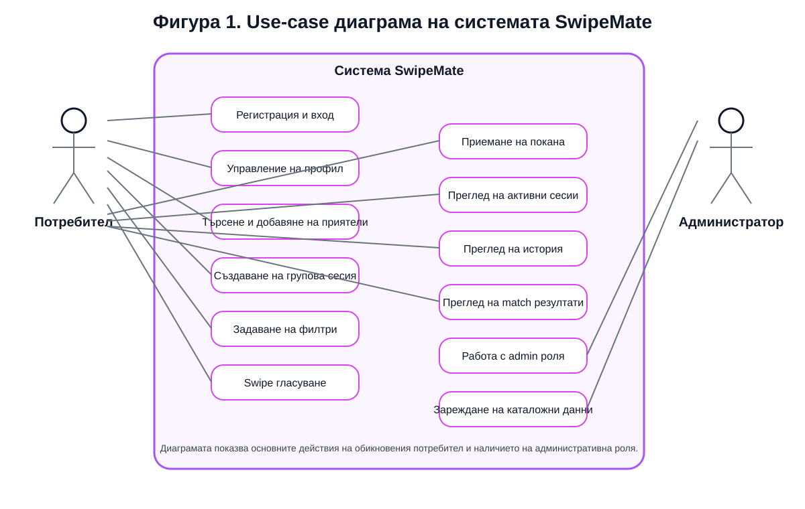

### 2.8.6. Архитектурна диаграма

На **Фигура 2** е представен опростен архитектурен модел на системата. Той показва връзката между MAUI клиента, ASP.NET Core Web API и PostgreSQL базата данни. Диаграмата онагледява реалното разделение на отговорностите в проекта.

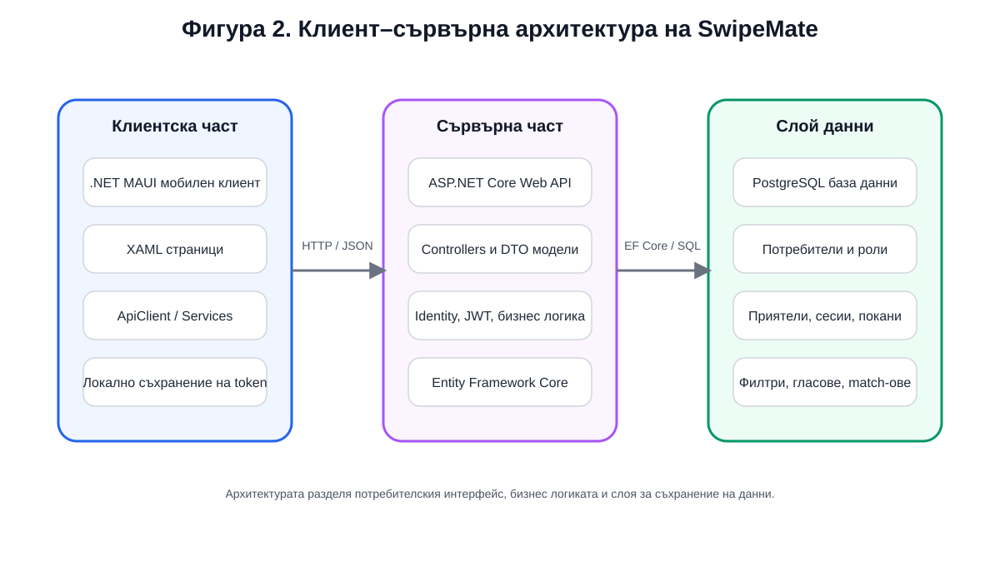

### 2.8.7. Предимства на избраната архитектура

Избраната архитектура има няколко важни предимства:

- ясна подялба на отговорностите;
- възможност за независимо развитие на клиента и сървъра;
- по-добра сигурност чрез централизирана обработка на удостоверяването;
- възможност за бъдещо добавяне на нов клиент към същото API;
- по-добра поддръжка на релационните данни и историята на действията.

Оттук следва, че архитектурният модел е подходящ не само за изпълнение на заданието, но и като основа за бъдещо разширение на продукта.

## 2.9. Моделиране и проектиране на данните

Базата данни е критична част от системата, защото именно тя осигурява трайното съхранение и връзките между потребители, роли, приятели, сесии и резултати. Проектирането на данните е извършено така, че да отразява реалната логика на приложението и да не допуска загуба на информация при многократни тестове и използване.

### 2.9.1. Основни принципи при моделирането

При проектиране на базата данни бяха следвани следните принципи:

1. Да се избягва дублиране на данни, когато е възможно.
2. Да се използват отделни таблици за логически различни същности.
3. Да се реализират ясни връзки между таблиците.
4. Да се пази история на действията, а не само моментно състояние.
5. Да се предвиди възможност за бъдещо разширяване с нови категории и нови типове филтри.

### 2.9.2. Основни таблици и същности

В системата се използват следните основни същности:

- `ApplicationUser` – потребителски профил;
- `IdentityRole` и свързаните Identity таблици – роля и връзка между роли и потребители;
- `FriendRequest` – заявка за приятелство;
- `Friendship` – прието приятелство между двама потребители;
- `DecisionSession` – групова сесия за избор;
- `SessionParticipant` – участник в сесия;
- `SessionInvitation` – покана към участник;
- `SessionFilter` – запазени филтри на отделните участници;
- `SessionVote` – индивидуален глас върху конкретно предложение;
- `SessionMatch` – записан резултат от съвпадение;
- `CatalogItem` – предложение от съответна категория.

### 2.9.3. Връзки между същностите

Връзките между данните са организирани така, че една сесия да може да има много участници, всеки участник да има свои филтри и свои гласове, а една сесия да може да произведе един или повече match резултати. Освен това една заявка за приятелство има жизнен цикъл – създаване, приемане или отказ, а едно приятелство представлява трайна връзка между двама потребители.

### 2.9.4. ER диаграма

Опростената ER диаграма е показана на **Фигура 3**. Тя илюстрира как са свързани основните таблици в проекта.

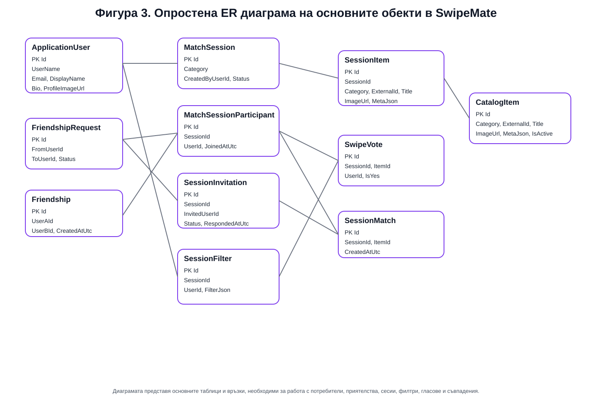

### 2.9.5. Описание на основните таблици

#### Таблица `ApplicationUser`

Тази таблица съдържа информация за регистрираните потребители. Освен стандартните Identity полета тя пази и специфични за проекта данни, например display name, биография и други атрибути, свързани с профила.

#### Таблица `FriendRequest`

Тук се съхраняват заявките за приятелство между потребителите. Таблицата е нужна, защото между момента на изпращане на заявката и момента на приемането й съществува междинно състояние, което не може да се моделира само чрез таблица за приятелства.

#### Таблица `Friendship`

Таблицата съдържа вече приетите приятелства. Само такива връзки се използват при създаване на групови сесии.

#### Таблица `DecisionSession`

Това е основната таблица за груповия процес на избор. В нея се пазят категорията, създателят, датата на създаване, статуса и други атрибути на сесията.

#### Таблица `SessionParticipant`

Тази таблица свързва потребителите с конкретна сесия. Тя позволява една сесия да има повече от един участник и е ключова за груповата логика.

#### Таблица `SessionInvitation`

Тук се пазят поканите за участие. Това е отделна таблица, защото в един момент потребителят може да бъде поканен, но все още да не е приел. Това състояние трябва да бъде отчетено.

#### Таблица `SessionFilter`

В тази таблица се пазят филтрите на отделните участници. Избраният модел позволява всеки участник да запази свой набор от критерии, а сървърът да обедини тези предпочитания при формиране на предложенията.

#### Таблица `SessionVote`

Тази таблица пази всеки положителен или отрицателен глас върху конкретно предложение. Тя е необходима не само за откриване на match, но и за това системата да не предлага повторно вече оценени варианти.

#### Таблица `SessionMatch`

Тук се записва всеки постигнат match. Таблицата позволява съвпаденията да бъдат визуализирани по-късно в историята, както и да се изведе информация с кои участници е постигнато съгласието.

#### Таблица `CatalogItem`

Тази таблица съдържа примерните предложения в категориите филми, ресторанти, рецепти и настолни игри. Тя служи като източник на данни за сесиите.

### 2.9.6. Причини за избраната структура

Избраната структура на данните е подходяща, защото моделира отделно различните жизнени цикли в приложението. Потребителят може да има приятелство, заявка, покана, участие, филтър, глас и match история – всяко от тези понятия има своя роля и не бива да се смесва с останалите. Това прави базата по-прегледна, по-лесна за тестване и по-устойчива при бъдещо разширяване.

<table>
<caption>Таблица 3. Основни таблици в базата данни и тяхната роля</caption>
<thead>
<tr><th>Таблица / същност</th><th>Съдържание</th><th>Роля в системата</th></tr>
</thead>
<tbody>
<tr><td>ApplicationUser</td><td>Потребителски профили и Identity данни</td><td>Осигурява регистрация, вход и лична идентичност</td></tr>
<tr><td>FriendRequest</td><td>Входящи и изходящи заявки за приятелство</td><td>Реализира социалния слой преди създаване на приятелство</td></tr>
<tr><td>Friendship</td><td>Приети връзки между потребители</td><td>Определя кои потребители могат да бъдат канени в сесия</td></tr>
<tr><td>DecisionSession</td><td>Групови сесии по категории</td><td>Централна таблица за процеса на общия избор</td></tr>
<tr><td>SessionInvitation</td><td>Покани за участие</td><td>Пази междинното състояние преди приемане на сесията</td></tr>
<tr><td>SessionParticipant</td><td>Участници в приети сесии</td><td>Свързва потребители със сесии</td></tr>
<tr><td>SessionFilter</td><td>Предпочитания на отделните участници</td><td>Осигурява персонални критерии за избор</td></tr>
<tr><td>SessionVote</td><td>Положителни и отрицателни гласове</td><td>Използва се за определяне на съвпаденията и историята на действията</td></tr>
<tr><td>SessionMatch</td><td>Записани съвпадения</td><td>Пази резултатите от груповото съгласие</td></tr>
<tr><td>CatalogItem</td><td>Каталожни данни за филми, ресторанти, рецепти и игри</td><td>Източник на предложения за сесиите</td></tr>
</tbody>
</table>

## 2.10. Реализация на софтуерната система

### 2.10.1. Реализация на backend частта

Backend проектът `SwipeMate.Api` е основата на бизнес логиката и достъпа до базата данни. В него са реализирани:

- конфигурация на услугите и middleware компонентите;
- контекст на базата данни и миграции;
- модели и DTO класове;
- контролери за автентикация, приятели, профил, сесии, филтри и история;
- seed логика за административната роля и примерни данни.

При стартиране backend-ът конфигурира връзката към PostgreSQL, подготвя Identity услугите и активира JWT удостоверяване. По този начин защитените крайни точки могат да бъдат използвани само от удостоверени потребители.

### 2.10.2. Реализация на регистрация и вход

Модулът за регистрация и вход е реализиран чрез `AuthController`. При регистрация се проверява дали потребителското име и имейлът са валидни и дали не съществуват вече в системата. При успех се създава нов потребителски акаунт. При вход потребителят подава своите идентификационни данни, а backend-ът връща JWT token, съдържащ информация за идентичността и ролята на потребителя.

Тази реализация е важна не само за сигурността, но и за цялостното поведение на приложението. Много от екраните изискват защитени заявки и без правилно реализиран вход системата не би могла да функционира коректно.

### 2.10.3. Реализация на профил

Профилният модул позволява преглед и редакция на информацията за потребителя. Освен потребителско име и имейл, приложението поддържа display name и кратка биография, което прави средата по-персонализирана. Това е важна част от усещането за завършен продукт, защото приложението не изглежда като временен прототип, а като среда с лична идентичност на потребителите.

### 2.10.4. Реализация на модул „Приятели“

Модулът за приятели претърпя няколко доработки по време на проекта. Първоначално добавянето изискваше ръчно въвеждане на потребителско име, но в по-късен етап беше реализирано търсене на съществуващи профили. Това подобрява удобството и доближава поведението на приложението до стандартна социална функционалност.

Логиката включва:

- търсене на потребители;
- изпращане на заявка за приятелство;
- показване на входящи заявки;
- приемане или отказ;
- визуализация на списък с приятели.

Този модул е ключов, защото създава социалната основа, върху която се изграждат груповите сесии.

### 2.10.5. Реализация на създаване на сесия

Създаването на сесия започва от началния екран чрез избор на категория. След това се отваря екран за избор на приятели, които да бъдат поканени. Това поведение е съобразено както със заданието, така и с Figma дизайна. Реализацията подчертава, че сесията е групова и не трябва да се разглежда като изцяло самостоятелен индивидуален процес.

След потвърждаване backend-ът:

1. създава нова сесия;
2. добавя създателя като участник;
3. създава покани към избраните приятели;
4. връща резултат към клиента.

### 2.10.6. Реализация на покани и участие

За да бъде сесията реално групова, поканите се записват отделно и не се превръщат автоматично в участие. Поканеният потребител вижда pending invitation и сам решава дали да приеме. По този начин логиката е по-близка до реалния живот, а системата по-точно отразява условието на дипломния проект, че групата участва съвместно в избора.

### 2.10.7. Реализация на филтрите

След приемане на поканата всеки участник може да отвори `My Filters` и да въведе свои предпочитания. В зависимост от категорията се поддържат различни полета. При филмите това са например жанр, минимален рейтинг и диапазон на годините, при ресторантите – кухня, локация и ценови клас, при рецептите – тип и сложност, а при настолните игри – брой играчи и продължителност.

Съществено проектно решение е, че филтрите на участниците се обработват като **обединение**, а не като сечение. Това означава, че ако един потребител харесва драма, а друг комедия, системата може да покаже и двата типа варианти. Ако се използваше сечение, често би се стигнало до твърде малък брой предложения или дори до нулев резултат. Избраната реализация е по-подходяща за практическата цел на приложението.

### 2.10.8. Реализация на swipe гласуването

Swipe страницата представя предложенията като визуални карти. Всяка карта съдържа изображение, заглавие, кратко описание и допълнителна информация. Потребителят може да извърши положително или отрицателно действие. При backend обработката всеки глас се записва в таблицата `SessionVote`, а системата проверява дали същият потребител вече не е гласувал за същото предложение.

Тази проверка е необходима, за да не се стига до повторни записи и некоректни match резултати. По време на разработката бяха направени корекции именно в тази логика, тъй като тестовете с два акаунта показаха случаи, в които същият запис се обработваше повторно. След доработката системата работи по-надеждно и преминава към следващата карта коректно.

### 2.10.9. Реализация на match логиката

При положително гласуване backend-ът проверява дали и останалите участници са дали положителна оценка за същото предложение. Ако това е така, се създава `SessionMatch` и се връща резултат към клиента. В по-късен етап логиката беше доразвита така, че да различава частично съвпадение и пълно съвпадение на групата, както и да може да визуализира участниците, с които е постигнат match.

Допълнително беше реализирано поведение, при което след откриване на match потребителят може да реши дали да прекрати сесията или да продължи. Това решение е по-близко до реалната употреба, защото понякога групата иска да разгледа повече от един подходящ вариант, вместо да приключи веднага след първото съвпадение.

### 2.10.10. Реализация на историята

Модулът за история пази информация както за предишните сесии, така и за откритите match резултати. За всяка сесия могат да се визуализират допълнителни данни, например участници, брой гласувания и използвани филтри. Това превръща историята в реална част от приложението, а не просто в списък със заглавия.

Историята е ценна и от гледна точка на дипломната разработка, защото показва, че данните не се използват само в момента на текущото действие, а се съхраняват и могат да бъдат анализирани впоследствие.

### 2.10.11. Реализация на началния екран

Началният екран играе ролята на централен навигационен панел. От него потребителят може да избере категория за нова сесия и да отвори основните модули – приятели, активни сесии, история и профил. По време на разработката бяха направени допълнителни подобрения, за да се постигне по-добро центриране на категориите и action картите при по-малки резолюции. Това беше важна част от responsive поведението на интерфейса.

### 2.10.12. Реализация на профил и административна роля

Административната роля е реализирана чрез seed логика, която създава административен акаунт при стартиране на backend-а. Така системата изпълнява изискването за наличие на администратор. Отделен мащабен административен панел не е разработен, но ролята и разграничението между типове потребители са налични и могат да бъдат разширени в бъдеще.

### 2.10.13. Реализация на примерните данни

За да може приложението да се демонстрира в завършен вид, в базата са добавени примерни предложения във всяка категория. Това позволява създаване на реални тестови сесии без зависимост от външни API услуги. Същевременно архитектурата е такава, че в бъдеще тези примерни данни могат да бъдат заменени с динамично извличани данни от външен източник.

### 2.10.14. Кодови фрагменти

В **Приложение А** са показани избрани кодови фрагменти на бял фон, свързани с конфигурацията на backend-а, създаването на сесии и мобилния интерфейс. Те илюстрират ключови части от реализацията и служат като визуално доказателство за разработката.

## 2.11. Потребителска документация

Настоящият раздел описва как крайният потребител работи със системата от момента на стартирането й до създаването на match.

### 2.11.1. Стартиране на системата

За локално стартиране първо се пуска `SwipeMate.Api`. Backend приложението трябва да слуша на локален адрес и да бъде достъпно по HTTP. След това се стартира мобилният клиент `SwipeMate.Mobile`.

При тестова среда се използват различни адреси:

- за Windows Machine: `http://localhost:5274`;
- за Android Emulator: `http://10.0.2.2:5274`.

Това е необходимо, защото Android емулаторът не използва `localhost` по същия начин както Windows клиента.

Полето `Server URL`, което присъства на екраните за вход и регистрация в демонстрационната версия, е добавено с практическа цел за локално тестване в различни среди. При реално публикуване на приложението това поле не би било показвано на крайния потребител. Вместо това адресът на backend услугата би бил конфигуриран предварително в самото приложение или чрез външна конфигурация за production среда.

Важно е да се отбележи, че в настоящия етап проектът е реализиран като **локално демонстрационно решение**, а не като публично хостнато приложение. Това не противоречи на задачата, защото дипломният проект изисква създаване на работеща система, база данни, backend и мобилен клиент. Възможността за публично публикуване е разгледана като бъдеща посока за развитие, а не като задължителен завършен етап на текущата реализация.

### 2.11.2. Регистрация на нов потребител

От началния екран за вход потребителят може да избере опция за регистрация. На екрана за регистрация се въвеждат потребителско име, имейл адрес, парола и адресът на сървъра. След успешно създаване на акаунт системата връща съобщение за успех и пренасочва потребителя към екрана за вход.

### 2.11.3. Вход в системата

При вход потребителят въвежда своите данни и след успешна проверка се пренасочва към началния екран. Ако входът е успешен, JWT token-ът се съхранява локално и позволява последващи заявки без повторно въвеждане на парола.

### 2.11.4. Работа с профил

От екрана `My Profile` потребителят може да прегледа своите данни, статистика, биография и история на активността. В профила са видими и определени обобщени показатели, което подобрява цялостното потребителско преживяване.

### 2.11.5. Добавяне на приятел

Потребителят отваря екрана `Friends`, започва да въвежда име и системата показва съществуващи профили, които съответстват на заявката. След избор на потребител се изпраща заявка за приятелство. Получателят я вижда в собствената си секция за заявки и може да я приеме.

### 2.11.6. Създаване на групова сесия

От началния екран потребителят избира една от наличните категории. След това се отваря екранът за създаване на сесия, където се избират приятели. При потвърждение се изпращат покани към тях.

### 2.11.7. Приемане на покана

Поканеният потребител отваря `Active Sessions`, където вижда отделна секция за pending invitations. Оттам той може да приеме или откаже участието си. След приемане сесията се появява сред текущите сесии.

### 2.11.8. Задаване на филтри

Всеки участник има възможност да отвори `My Filters` за конкретната сесия и да въведе свои предпочитания. Това действие е независимо за всеки потребител и е важна част от груповия механизъм.

### 2.11.9. Swipe и match

След отваряне на сесията предложенията започват да се визуализират като карти. Потребителят може да избира „за“ или „против“. При съвпадение се отваря специален match екран. Match-ът се записва и в историята.

### 2.11.10. Преглед на историята

От екрана `History` потребителят може да види проведените сесии и match резултатите. При отваряне на детайли за сесията се визуализира повече информация за участниците, броя на гласовете и използваните филтри.

## 2.12. Документация за администратор

Съгласно изискванията на заданието в системата е налична административна роля. За демонстрационни цели е реализиран seed-нат административен акаунт:

- потребителско име: `admin`
- парола: `admin123`

### 2.12.1. Функция на административната роля

Основната цел на реализираната администраторска роля е да покаже поддръжка на роли и разграничение между различни типове потребители. Това е важно изискване на дипломния проект и е реализирано в backend частта чрез Identity и ролеви claims в JWT token-а.

### 2.12.2. Административни възможности в настоящата версия

В текущата реализация административната роля е представена като структурна и логическа възможност, но без разработен отделен мащабен административен панел. Това е приемливо в контекста на дипломния проект, защото основният фокус е върху потребителското приложение за колективен избор. Въпреки това системата е изградена така, че при необходимост може да бъде разширена със следните функции:

- управление на каталогните данни;
- преглед на регистрираните потребители;
- модериране на съдържание;
- преглед на статистика за използването на приложението.

### 2.12.3. Причини за този подход

В рамките на проекта беше приоритетно да се реализира стабилен потребителски сценарий, защото именно той изпълнява основната идея на темата. Администраторската роля присъства като задължителен елемент от архитектурата и сигурността, а нейното бъдещо доразвиване е естествена следваща стъпка.

## 2.13. Тестване на системата

Тестването има за цел да докаже, че разработената система изпълнява предвидените функционалности и отговаря на основните сценарии от заданието. В проекта беше проведено както модулно, така и интеграционно тестване чрез реални потребителски действия.

### 2.13.1. Тестова среда

Използвана е следната тестова среда:

- backend приложение `SwipeMate.Api`;
- мобилен клиент `SwipeMate.Mobile`;
- база данни PostgreSQL;
- Windows Machine;
- Android Emulator;
- два различни потребителски акаунта за паралелен тестов сценарий.

### 2.13.2. Тестови сценарии

#### Сценарий 1: Регистрация

Целта е да се провери дали нов потребител може да се регистрира успешно. Входни данни са потребителско име, валиден имейл и парола. Очакваният резултат е създаване на нов запис в базата и възможност за последващ вход.

#### Сценарий 2: Вход

Проверява се дали регистрираният потребител може да получи валиден JWT token и достъп до защитените модули.

#### Сценарий 3: Добавяне на приятел

Потребител 1 търси потребител 2, изпраща заявка, а потребител 2 я приема. Очакваният резултат е двамата да се появят в списъка си с приятели.

#### Сценарий 4: Създаване на групова сесия

Потребител 1 избира категория и изпраща покана към потребител 2. Очаква се втората страна да види pending invitation.

#### Сценарий 5: Приемане на покана

Потребител 2 приема поканата. Очакваният резултат е сесията да стане достъпна и за двамата участници.

#### Сценарий 6: Задаване на филтри

И двамата участници задават филтри за една и съща сесия. Очаква се системата да обработи тези филтри коректно и да подготви предложенията.

#### Сценарий 7: Swipe гласуване

И двамата участници гласуват за предложенията. Проверява се дали системата пази гласовете коректно и не допуска повторно гласуване върху една и съща карта.

#### Сценарий 8: Match

И двамата участници харесват едно и също предложение. Очакваният резултат е визуализация на match екран и запис в историята.

#### Сценарий 9: История

След приключване на сесията се проверява дали тя присъства в историята и дали match резултатът е видим.

#### Сценарий 10: Работа с администраторски акаунт

Извършва се вход с административния акаунт, за да се докаже наличието на административна роля.

### 2.13.3. Резултати от тестването

Тестовете показаха, че основните функции на системата работят коректно. Успешно бяха проверени:

- регистрация и вход;
- списък с приятели;
- изпращане и приемане на заявки;
- създаване на сесия и покани;
- задаване на филтри;
- swipe гласуване;
- откриване на match;
- запис на история;
- работа с административна роля.

### 2.13.4. Установени проблеми и тяхното отстраняване

По време на разработката и тестването бяха открити няколко съществени практически проблема:

1. проблеми с конфигурацията на хоста и портовете;
2. различно адресиране между Windows Machine и Android Emulator;
3. сривове на Android Emulator и проблеми с локалната среда;
4. некоректно поведение при повторно използване на един и същ `HttpClient`;
5. нужда от подобрение на логиката за активни и приключени сесии;
6. необходимост от по-ясен invitation flow;
7. ограничен брой примерни данни в началния каталог;
8. нужда от подобряване на responsive поведението на началния екран;
9. нужда от по-удобно търсене на приятели.

Всеки от тези проблеми беше анализиран и последователно отстранен. Това е важен аспект на дипломния проект, защото показва реален инженерeн процес – не просто създаване на първоначална версия, а довеждането й до стабилно работещо състояние.

### 2.13.5. Оценка на надеждността

В рамките на локалната тестова среда системата може да бъде оценена като надеждна за демонстрационните и учебни цели на проекта. Основните потребителски сценарии са покрити и приложението позволява реално представяне по време на защита.

### 2.13.6. Съответствие със зададените изисквания

За да бъде ясно показано съответствието със зададената тема и условието на дипломния проект, в настоящия раздел обобщено се посочва как реализираната система покрива основните изисквания:

1. **Регистрация и вход** – реализирани са отделни екрани и backend логика за създаване на акаунт и удостоверяване.
2. **Списък с приятели** – реализирани са търсене на потребители, заявки за приятелство, приемане и списък с приятели.
3. **Създаване и управление на сесии** – реализирани са групови сесии, покани и участие на повече от един потребител.
4. **Swipe функционалност за „за“ и „против“** – реализирано е гласуване върху карти с положителен и отрицателен вот.
5. **Показване на съвпадения** – реализиран е match екран и история на съвпаденията.
6. **Филтриране по категории, локация и други признаци** – реализирани са отделни филтри по категории, като при групов избор се използва обединение на предпочитанията.
7. **Backend, разработен с подходяща технология** – реализиран е ASP.NET Core Web API.
8. **Създадена база данни** – реализирана е PostgreSQL база данни с таблици за потребители, роли, приятели, сесии, покани, филтри, гласове и съвпадения.
9. **Потребители и администратори** – налични са стандартна потребителска и административна роля.
10. **Тестване** – проведени са тестове с два едновременно използвани акаунта в локална среда.

По този начин може да се приеме, че основните теми и задължителни компоненти от зададеното условие са обхванати в разработката и документацията.

### 2.13.7. Бележка относно внедряване и достъпност

Настоящата версия на SwipeMate е подготвена основно за локално стартиране и защита на дипломния проект. Това означава, че за демонстрация е необходимо backend и mobile клиентът да бъдат стартирани в подходяща среда, а потребителските акаунти да бъдат създадени в локалната база данни. В документацията и в придружаващия `readMe.txt` файл е описана точната последователност за стартиране.

Липсата на публичен hosting на този етап не се представя като недостатък, а като естествена граница на учебния проект. Важното е, че архитектурата позволява такова разширение в бъдеще, например чрез публикуване на backend-а в cloud среда и използване на реален публичен адрес вместо локални URL-и.

## 2.14. Приноси на дипломния проект

Приносите на настоящия дипломен проект могат да бъдат формулирани по следния начин:

1. Анализиран е реален потребителски проблем, свързан с колективното вземане на решения в малка група.
2. Разработено е мобилно приложение с интуитивен swipe-базиран интерфейс.
3. Реализирана е клиент–сървърна архитектура с ясно отделени нива.
4. Изградена е база данни за потребители, роли, приятели, покани, сесии, филтри, гласове и съвпадения.
5. Реализирана е работеща логика за създаване на групови сесии и потвърждение на участие.
6. Реализирано е персонално задаване на филтри от различните участници.
7. Реализирана е обработка на предложенията чрез swipe гласуване.
8. Реализирана е логика за match откриване и запис в историята.
9. Реализирани са потребителска и административна роля.
10. Проведено е тестване с два едновременно използвани акаунта в локална среда.

Тези приноси показват, че проектът не е само демонстрация на интерфейс, а цялостна разработка с анализ, архитектура, данни, логика и практика.

# 3. Заключение

В резултат от изпълнението на дипломния проект беше разработено мобилно приложение, което предлага практически работещо решение на често срещан проблем – трудността при постигане на общ избор в група потребители. Чрез SwipeMate процесът на избор се структурира, ускорява и прави по-удобен, като всеки участник участва активно със своите предпочитания.

Постигнатият резултат обединява няколко важни направления от специалността „Системно програмиране“: работа с мобилни технологии, клиент–сървърна архитектура, база данни, автентикация, обработка на бизнес логика и разработка на завършен потребителски интерфейс. Това превръща проекта в добър практически пример за прилагане на натрупаните знания в една реалистична софтуерна разработка.

Може да се заключи, че основната цел на дипломния проект е постигната. Реализирани са регистрация и вход, списък с приятели, групови сесии, покани, филтри, swipe гласуване, match логика, история и административна роля. Извършеното тестване потвърждава, че системата работи в локална среда и е подходяща за демонстрация и защита.

Въпреки това проектът има и потенциал за бъдещо развитие. Някои възможни посоки са:

- публикуване на backend-а в cloud среда;
- добавяне на реални външни източници на данни за филми, ресторанти и игри;
- изпращане на push notifications при покана и match;
- разширяване на административните възможности;
- добавяне на статистика, анализи и препоръки на база предишни избори;
- по-нататъшно доизпипване на визуалния дизайн и адаптивността на интерфейса.

Следователно SwipeMate може да бъде разглеждан както като завършен учебен проект, така и като основа за бъдещ по-мащабен софтуерен продукт.

:::pagebreak

# 4. Използвана литература

## 4.1. Книги

1. Андонов, Ф., Манев, К., Манева, Н., Минчев, Д., Христова, В. *Учебник по информатика – профилирана подготовка*. София, Клет, 2023.
2. Fires, M., Felker, D. *Разработване на приложения за Android for Dummies*. АлексСофт, 2015.
3. Lock, Andrew. *ASP.NET Core in Action*. Third Edition. Manning, 2023. ISBN 9781633438620.
4. Marcotte, Carl-Hugo. *Architecting ASP.NET Core Applications: An atypical design patterns guide for .NET 8, C# 12, and beyond*. Packt Publishing, 2024. ISBN 9781805123385.
5. McWherter, J., Gowell, S. *Professional Mobile Application Development*. Wrox, 2012.
6. Наков, Светлин, Колев, Веселин. *Принципи на програмирането със C#*. Фабер, Велико Търново, 2018. ISBN 9786190007784.
7. Сомова, Елена, Донева, Росица, Гафтанджиева, Силвия. *Обектно-ориентирано проектиране и програмиране: с примери на C#*. Университетско издателство „Паисий Хилендарски“, 2020.
8. Уогнър, Бил. *Ефективно програмиране със C#*. АлексСофт, 2022. ISBN 9789546564528.

## 4.2. Уебсайтове

1. Microsoft Learn. *.NET MAUI documentation*. Достъпно на: https://learn.microsoft.com/dotnet/maui/ (април 2026).
2. Microsoft Learn. *ASP.NET Core Web API documentation*. Достъпно на: https://learn.microsoft.com/aspnet/core/web-api/ (април 2026).
3. Microsoft Learn. *Authentication and authorization in ASP.NET Core*. Достъпно на: https://learn.microsoft.com/aspnet/core/security/ (април 2026).
4. Microsoft Learn. *Overview of ASP.NET Core Identity*. Достъпно на: https://learn.microsoft.com/aspnet/core/security/authentication/identity (април 2026).
5. Microsoft Learn. *Entity Framework Core documentation*. Достъпно на: https://learn.microsoft.com/ef/core/ (април 2026).
6. Microsoft Learn. *ASP.NET MVC overview*. Достъпно на: https://learn.microsoft.com/en-us/aspnet/mvc/overview/older-versions-1/overview/asp-net-mvc-overview (април 2026).
7. Npgsql Team. *Npgsql Documentation*. Достъпно на: https://www.npgsql.org/doc/ (април 2026).
8. PostgreSQL Global Development Group. *PostgreSQL Documentation*. Достъпно на: https://www.postgresql.org/docs/ (април 2026).
9. W3Schools. *CSS Introduction*. Достъпно на: https://www.w3schools.com/css/css_intro.asp (април 2026).
10. Mozilla Developer Network. *HTML documentation*. Достъпно на: https://developer.mozilla.org/en-US/docs/Web/HTML (април 2026).
11. Mozilla Developer Network. *Styling basics*. Достъпно на: https://developer.mozilla.org/en-US/docs/Learn_web_development/Core/Styling_basics (април 2026).

:::pagebreak

# 5. Приложения

В основния текст са направени препратки към фигурите и приложенията, включени в този раздел. Приложенията имат за цел да обогатят основната част с визуални и технически материали, без да нарушават нейната четимост.

## Приложение А. Кодови фрагменти

Приложение А съдържа подбрани кодови фрагменти на бял фон, свързани с основни части от реализацията. То се използва като допълнително доказателство за практическата разработка.

### Фигура А1. Конфигуриране на backend приложението
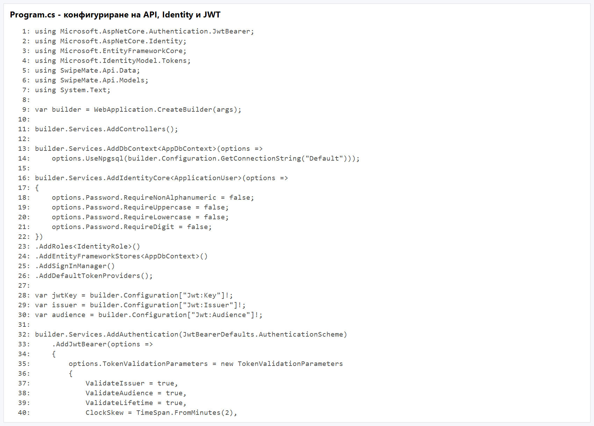

### Фигура А2. Създаване на групова сесия и покани
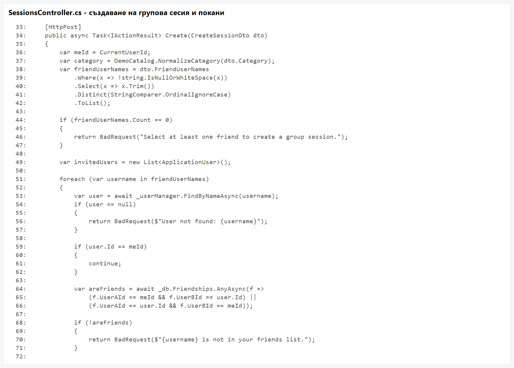

### Фигура А3. Основен екран на мобилния клиент
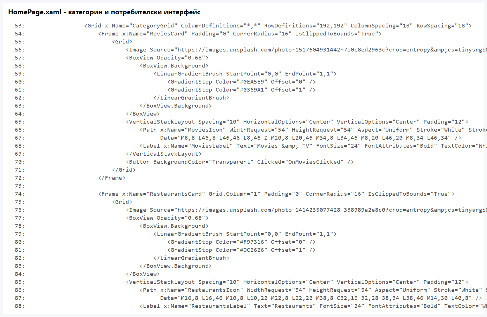

### Фигура А4. Търсене на потребители и добавяне на приятели
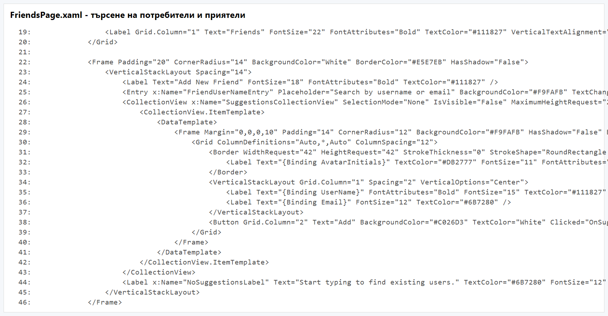

:::pagebreak

## Приложение Б. Екранни снимки на мобилното приложение

Приложение Б представя избрани екрани от реално работещата мобилна част на системата. Те допълват основната част на документацията и показват визуалния облик на приложението след приключване на разработката.

### Фигура Б1. Начален екран на приложението
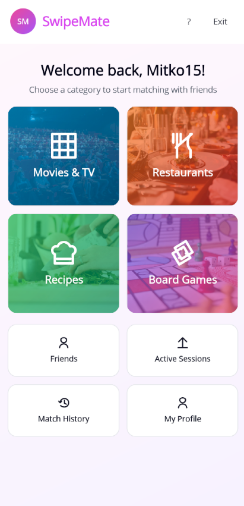

### Фигура Б2. Екран „Приятели“
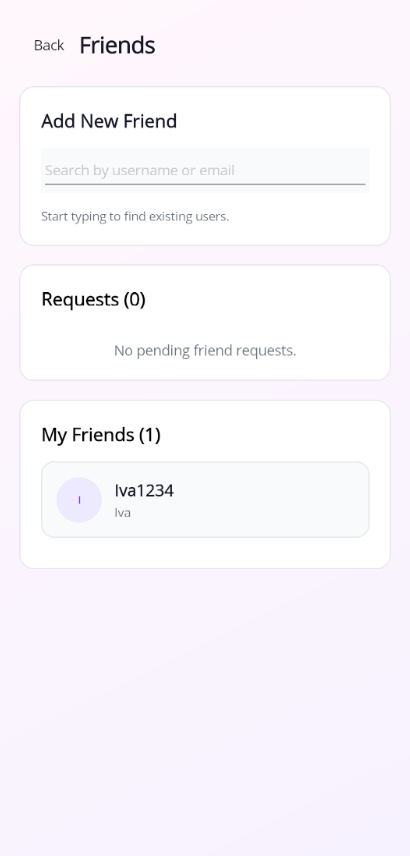

### Фигура Б3. Екран „Създаване на сесия“
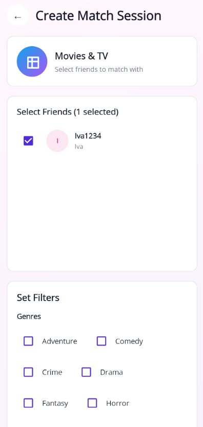

### Фигура Б4. Екран „Филтри“
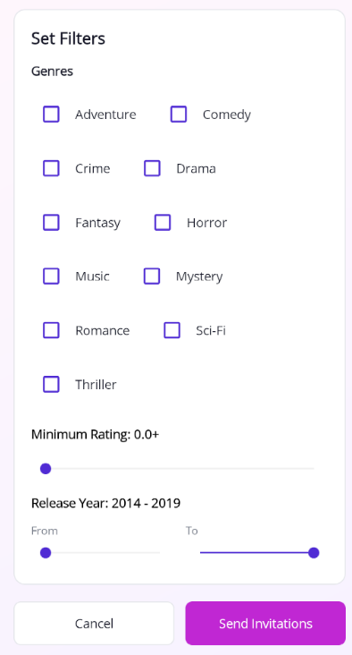

### Фигура Б5. Профил на потребителя – основна част
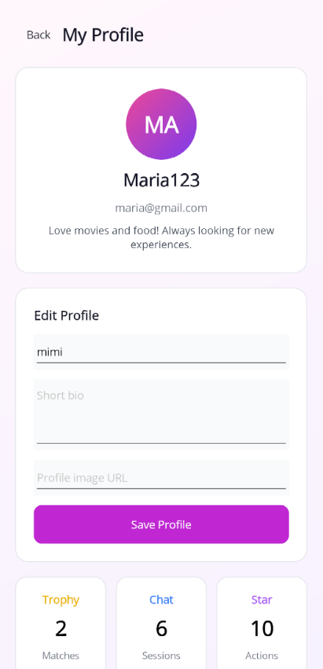

### Фигура Б6. Профил на потребителя – статистика и постижения
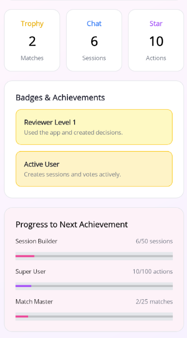

### Фигура Б7. Екран „История на сесиите“
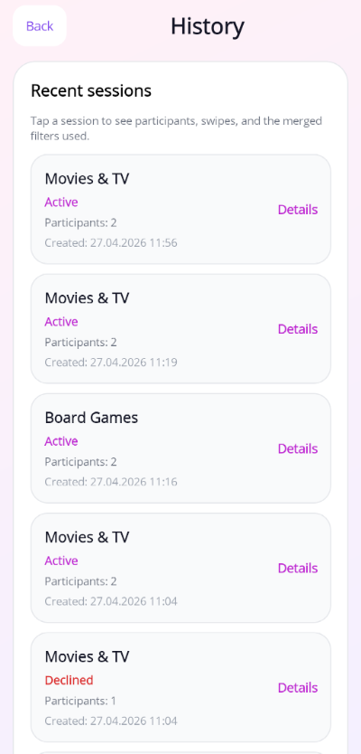

### Фигура Б8. Екран „История на съвпаденията“
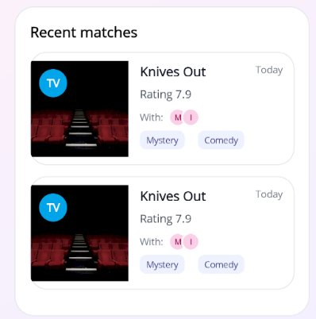

:::pagebreak

## Приложение В. Подробно описание на основните случаи на употреба

### В1. Регистрация на потребител

Участник: нерегистриран потребител.  
Предусловие: приложението е стартирано и backend-ът е достъпен.  
Основен поток:

1. Потребителят отваря екрана за регистрация.
2. Въвежда потребителско име, имейл и парола.
3. Потвърждава операцията.
4. Системата валидира данните.
5. При успех създава нов акаунт и връща резултат към клиента.

Постусловие: създаден е нов потребителски акаунт.

### В2. Добавяне на приятел

Участник: регистриран потребител.  
Предусловие: потребителят е влязъл в системата.  
Основен поток:

1. Отваря екрана `Friends`.
2. Започва да въвежда име.
3. Системата показва съществуващи профили.
4. Потребителят избира един от тях.
5. Изпраща заявка за приятелство.
6. Получателят приема или отказва заявката.

Постусловие: при приемане се създава приятелство между двамата потребители.

### В3. Създаване на групова сесия

Участник: регистриран потребител.  
Предусловие: има поне един приятел.  
Основен поток:

1. Потребителят избира категория от началния екран.
2. Отваря се екранът за създаване на сесия.
3. Потребителят избира един или повече приятели.
4. Системата създава сесия и изпраща покани.
5. Поканените участници приемат или отказват.

Постусловие: сесията е готова за работа с приетите участници.

### В4. Използване на филтри

Участник: участник в сесия.  
Предусловие: потребителят е приел участие в сесията.  
Основен поток:

1. Потребителят отваря `My Filters`.
2. Попълва желаните критерии.
3. Системата записва данните.
4. Backend-ът ги включва в общия набор за предложения.

Постусловие: предпочитанията на потребителя са включени в груповия избор.

### В5. Match

Участници: двама или повече потребители.  
Предусловие: има активна сесия и предложения за гласуване.  
Основен поток:

1. Всеки участник разглежда картите.
2. Дава положителен или отрицателен вот.
3. Системата сравнява резултатите.
4. При съвпадение записва match.
5. Показва екран с резултат.

Постусловие: съвпадението е записано в историята.

## Приложение В. Подробно описание на базовите таблици

### В1. Потребители и роли

Identity таблиците реализират основната потребителска инфраструктура. Чрез тях се поддържат регистрация, пароли, роли и връзка между потребителя и административните права.

### В2. Социален слой

Таблиците за заявки за приятелство и приятелства реализират социалния слой на системата. Те гарантират, че груповите сесии се създават между реално свързани потребители.

### В3. Сесиен слой

Таблиците за сесии, участници и покани реализират временната работна среда на приложението. Именно те моделират кой участва в процеса на избор, кога сесията е създадена и какъв е нейният текущ статус.

### В4. Слой за предпочитания и резултати

Таблиците за филтри, гласове и match резултати пазят най-съществената логика на приложението. Благодарение на тях може да се проследи какви предпочитания са зададени, как е протекло гласуването и какъв е крайният резултат.

## Приложение Г. Подробни тестови сценарии

### Г1. Тест за регистрация

Входни данни: потребителско име, валиден имейл, парола.  
Очакван резултат: успешен запис в базата и възможност за вход.

### Г2. Тест за вход

Входни данни: валидно потребителско име и парола.  
Очакван резултат: получаване на token и достъп до защитени екрани.

### Г3. Тест за търсене на приятел

Входни данни: част от потребителско име.  
Очакван резултат: показване на съществуващи профили.

### Г4. Тест за заявка за приятелство

Входни данни: избран профил от резултатите.  
Очакван резултат: запис на заявката и възможност за приемане от отсрещната страна.

### Г5. Тест за покана към сесия

Входни данни: избрана категория и приятел.  
Очакван резултат: получаване на pending invitation от втория акаунт.

### Г6. Тест за приемане на покана

Входни данни: действие `Accept` от поканения потребител.  
Очакван резултат: достъп до сесията и възможност за гласуване.

### Г7. Тест за филтри

Входни данни: различни предпочитания от двама участници.  
Очакван резултат: коректно записване и обединяване на филтрите.

### Г8. Тест за swipe

Входни данни: последователни гласове „за“ и „против“.  
Очакван резултат: запис на всеки вот без повторно гласуване.

### Г9. Тест за match

Входни данни: положителен вот на всички участници за едно предложение.  
Очакван резултат: отваряне на match екран и запис в историята.

### Г10. Тест за история

Входни данни: приключила сесия с поне едно съвпадение.  
Очакван резултат: наличие на запис в `Recent sessions` и `Recent matches`.

## Приложение Д. Инструкции за локално стартиране

1. Необходимо е да бъде инсталиран .NET SDK.
2. Необходимо е да бъде достъпна PostgreSQL база данни.
3. Стартира се `SwipeMate.Api`.
4. След това се стартира `SwipeMate.Mobile`.
5. При Windows се използва `http://localhost:5274`.
6. При Android Emulator се използва `http://10.0.2.2:5274`.
7. За тест на административната роля може да се използва `admin / admin123`.

## Приложение Е. Препоръчителни изображения за печатния вариант

За окончателния печатен вариант могат да бъдат добавени внимателно подбрани екранни снимки със светла тема от следните екрани:

- вход;
- регистрация;
- начален екран;
- списък с приятели;
- екран за създаване на сесия;
- екран за филтри;
- swipe екран;
- match екран;
- история;
- профил.

Те следва да бъдат поставени така, че да подпомагат текста, а не да го претоварват. При печат е препоръчително страниците с изображения да бъдат отбелязани предварително като цветни.

